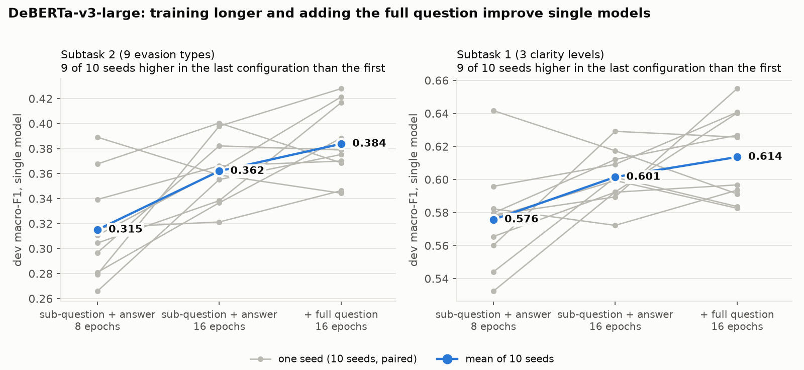
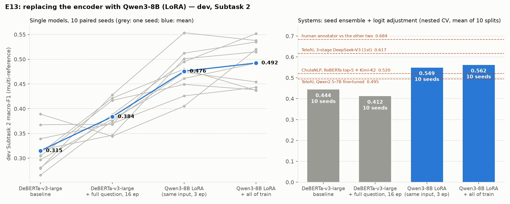

# CLARITY mid-evaluation report — Team Nier_ANLP

SemEval-2026 Task 6: classifying how politicians answer interview questions.

Every number below is on the **308-item dev set** unless marked, and comes from a file in this
repository; [`RESULTS.md`](RESULTS.md) gives the source of each. The test labels were never
released and Codabench has closed, so dev is the only place systems can be compared.
**Done** and **planned** work are kept apart: §5–7 are done, §8 is planned.

---

## 1. The problem

Given a sub-question from a presidential interview and the president's answer, classify the
answer into one of **9 evasion types** (Subtask 2). These nest under **3 clarity levels**
(Subtask 1): Clear Reply, Ambivalent, Clear Non-Reply. Both subtasks are scored by macro-F1. In
Subtask 2 a prediction counts as correct if it matches **any** of the annotators' labels: three
annotators per item on dev, two on test.

Like the dataset paper and the top two competition systems, we predict the 9-way label and derive
the 3-way label from the fixed taxonomy.

## 2. What the field shows

| system | split | Subtask 1 | Subtask 2 | source |
|---|---|---|---|---|
| TeleAI (1st), DeepSeek-V3, 3-stage prompting | test | 0.89 | 0.68 | task overview, Table 3 |
| moswisarut / ChulaNLP (2nd), RoBERTa top-5 → Kimi-K2 | test | 0.82 | 0.61 | task overview, Table 3 |
| organisers' baseline, fine-tuned Llama-70B | test | 0.82 | 0.57 | task overview, Table 2 |
| best encoder-only systems | test | ≤ 0.81 | ≤ 0.51 | task overview §5 |
| TeleAI pipeline | dev | 0.812 | 0.617 | TeleAI, Table 2 |
| DeepSeek-V3, single-step chain-of-thought | dev | 0.710 | 0.490 | TeleAI, Table 2 |
| DeepSeek-V3, asked directly for the label | dev | 0.662 | 0.421 | TeleAI, Table 2 |
| Qwen2.5-7B, LoRA fine-tuned, no chain-of-thought | dev | 0.587 | 0.495 | TeleAI, Table 2 |
| ChulaNLP's DeBERTa-large, checkpoint chosen on dev | dev | 0.65 | 0.46 | ChulaNLP paper |

- **The top systems are multi-call LLM pipelines.** TeleAI averages 1.94 model calls and about
  7,300 input tokens per item.
- **Encoders stop around 0.50 on test Subtask 2**, whatever the scale or ensembling.
- **A fine-tuned 7B model without chain-of-thought already reaches 0.495 on dev,** level with a
  frontier model reasoning step by step (0.490).

## 3. Our question

**How much of an expensive LLM pipeline's accuracy can a single-pass model recover, and at what
cost?** The end product is an accuracy-vs-cost curve, not a leaderboard position.

The first half of the project builds the cheapest point on that curve, a fine-tuned encoder, as
rigorously as we can, and finds out *why* it stops where it does.

## 4. Re-scoping from the proposal

The proposal set out five contributions. What we did with each, and why:

| | proposed | what happened |
|---|---|---|
| **C2** | Annotators agree more under a "coverage" cut of the taxonomy than under the official one | **Tested and refuted** before any modelling, from dev's three annotations (pre-registered): Krippendorff α 0.503 for the coverage cut vs 0.623 for the official one, Δ −0.120, p = 0.0004. The re-annotation study it would have motivated is dropped. |
| **C4** | A decision rule built for the multi-reference scorer: per-class thresholds over P(class in the annotator set) | **Tested; the simpler control won.** A derivation showed that when every prediction is acceptable, macro-F1 = (classes ever predicted) / 9: the rule can only buy *coverage* of rare classes. One parameter (logit adjustment) beats nine fitted per-class weights, which overfit 308 items. Details in §5. |
| **C1** | Replace the flat output with an attribute code shared across leaves | **Not built.** It needs attribute annotations (the dropped re-annotation). The taxonomy's hierarchy was instead tested three ways (§5); none beat the flat model. |
| **C3** | Annotator model from per-item annotator IDs | **Feasibility checked:** train has annotator IDs (three annotators, one per item), so the model is identifiable only through annotator marginals. Kept as analysis only. |
| **C5** | Coverage/engagement representation of the answer | **Replaced by a simpler test of the same need**: give the model the full journalist question, so it can see what else the answer responds to (§5). |

The evaluation protocol was kept and tightened: a frozen flat baseline, every change measured
against its own control, 10 seeds for any system claim, nested cross-validation for the one fitted
parameter, bootstrap intervals, and hypotheses written down before each run.

## 5. What we built (done)

**Infrastructure.**
- A replica of the official scorer, with its geometry worked out and verified.
- Frozen splits and a fully resumable training pipeline.
- A post-hoc decision-rule module, and a one-command analysis script that reproduces every number
  in this package in 24 s of CPU time.

**Floors.**

| baseline | Subtask 2 | Subtask 1 |
|---|---|---|
| always majority | 0.060 | 0.136 |
| uniform random | 0.129 | 0.299 |
| TF-IDF + logistic regression | 0.257 | 0.445 |

**The model.** DeBERTa-v3-large fine-tuned as a 9-way classifier. Two changes improved it, each
measured against its own control on 10 paired seeds:

| single model, 10 seeds | Subtask 2 | Subtask 1 |
|---|---|---|
| sub-question + answer, 8 epochs (baseline) | 0.315 ± 0.040 | 0.576 ± 0.030 |
| + 16 epochs | 0.362 ± 0.026 | 0.601 ± 0.016 |
| **+ full journalist question in the input** | **0.384 ± 0.030** | **0.614 ± 0.027** |

Baseline → final: Subtask 2 +0.069 (t = 3.6) and Subtask 1 +0.038, each on 9 of 10 seeds.

**Systems** (10-seed ensembles; the decision rule scored by nested cross-validation):

| | Subtask 2 | Subtask 1 |
|---|---|---|
| final model's ensemble, no dev tuning | 0.409 [95% CI 0.306, 0.472] | 0.621 |
| **final system** (ensemble + logit adjustment, chosen by a rule fixed in advance) | **0.405** | **0.648** |
| baseline ensemble + logit adjustment | 0.428 | 0.601 |
| final minus baseline ensemble, before any rule | +0.090 [+0.009, +0.168] | +0.024 |
| training on all of train, last epoch (5 seeds only; S1 without the rule) | 0.489 | 0.634 |

**What the tests showed:**
- **The rule repairs most of what the better model fixes.** Before the decision rule, the final
  model is clearly better than the baseline. The rule then lifts the baseline by +0.109 and the
  better model by nothing, so on Subtask 2 the two systems are level. On Subtask 1 the better
  model leads.
- **5-seed system numbers are unreliable here:** the same system scored 0.438 and 0.356 on two
  sets of seeds. That is why the table uses 10.
- **What did not help** (each documented with a reason):

| tried | result |
|---|---|
| a second encoder re-ranking the top 3 | 0.354 vs 0.365 |
| Balanced Softmax + focal loss | over-shifts to rare classes |
| three forms of hierarchy: post-hoc routing, a factorised head, specialist encoders | none beats the flat model |
| boundary experts for confused label pairs | no effect |
| model soups | 0.267 |
| nine per-class decision weights | erratic: 0.29–0.46 depending on which half of dev they are fitted on |

**The proposal's C4 prediction, checked.** It predicted the rule's gains would fall on items
where annotators disagree, not on unanimous ones.
- The rule raises the baseline's Subtask 2 from 0.319 to 0.428.
- Its in-set rate is unchanged overall. It loses on unanimous items (0.536 → 0.496) and gains on
  contested ones (2–1 splits 0.513 → 0.527; three-way splits 0.727 → 0.788).
- The gain comes from rare classes being named at all (`Partial` +0.43, `Claims ignorance` +0.32
  F1), plus the two most-disputed classes (`Deflection` +0.15, `General` +0.14).
- **Verdict: partly right, and the mechanism is coverage, not set membership.**

## 6. What the errors tell us

From the final model's 10-seed ensemble, with no dev tuning.

- **The model fails where humans don't.**
  - 137 of 308 predictions (44.5%) are outside the reference set, 53 of them on items all three
    annotators agreed on.
  - Scored the test set's way (two annotators), a human annotator against the other two reaches
    0.643–0.766 on Subtask 2 (mean 0.684). The model reaches 0.38.
  - The gap is the model, not label noise.
- **The confusion is about commitment as much as topic.**
  - By TeleAI's loose definition (any error involving Dodging, General or Deflection), 86.9% of
    our errors are "triangle" errors, vs their 77.7%.
  - But only 29% have both the prediction and a gold label inside the triangle.
  - Our largest error pairs are Implicit → Explicit (25), General → Implicit (20) and
    General → Explicit (20): *how committed* an answer is, not only whether it stays on topic.
- **Dodging is a strength:** recall 0.494 and F1 0.543, against TeleAI's 0.179 and 0.289.
- **Length matters, and test is short.**
  - Inputs the model still had to cut are acceptable only 20% of the time (n = 20).
  - The shorter half of dev scores 0.400 on Subtask 2, the longer half 0.283.
  - Test inputs have a median of 137 tokens against dev's 474, so dev likely understates test
    performance on this axis. Test's two-annotator reference sets cut the other way.
- **The model usually knows when it is unsure, and the answer is usually near the top.**
  - In-set rate is 0.823 for the most confident fifth of dev and 0.43–0.47 for the least
    confident three fifths.
  - An acceptable label is in the top 3 for 93.8% of items.
- **The 10 seeds are diverse but fail together.** They agree on only 51% of items. Where all 10
  agree they are acceptable 81% of the time; where they split, 50%.

Two typical errors (more in `analysis/error_examples.md`):

> *"Would you campaign against Senator Joe Lieberman on Iraq?"* — *"I'm going to stay out of
> Connecticut."* Annotators: Dodging, Dodging, Implicit. Model: General (p = 0.37). Reading this
> as a near-answer requires knowing Lieberman is a Connecticut senator.

> *"Are people who are saying that we're moving forward to a full war wrong?"* — the answer
> discusses speculation and violence without answering. Annotators: General ×3. Model: Dodging
> (p = 0.59).

## 7. Is the gap knowledge? An 8B classifier (done, 2026-10-02)

§6 says the model, not the labels, is what fails. Two explanations were left:
- **missing knowledge:** world and language knowledge a 0.4B encoder lacks, as in the Lieberman
  example above;
- **missing label meaning:** what each evasion type means, which 3,400 examples may not teach.

**E13 tests the first with one change: the backbone.** DeBERTa-v3-large becomes
**Qwen3-8B-Base fine-tuned with LoRA** (r = 16, all linear layers, a 9-way head on the last
token). Everything else is unchanged:
- the same rows and train slice;
- the same input (sub-question + full question + answer, 1024 tokens);
- the same loss and the same epoch selection on the train slice.

Seeds 0–9 are paired with DeBERTa's. Hypotheses and predictions were written in the experiment
log before every run. The runs used rented GPUs (JarvisLabs, 1× RTX PRO 6000 per VM), logged to
W&B, and every seed is on the team's HF repo. Sources: [`RESULTS.md`](RESULTS.md) §9.

| dev, 10 paired seeds | Qwen3-8B LoRA | DeBERTa (best, §5) | difference |
|---|---|---|---|
| single model, Subtask 2 | **0.476 ± 0.043** | 0.384 ± 0.030 | **+0.092, 10/10 seeds up** (t = 7.1) |
| single model, Subtask 1 | **0.709 ± 0.031** | 0.614 ± 0.027 | **+0.095, 10/10 seeds up** |
| **system** (10-seed ensemble + logit adjustment, nested CV), Subtask 2 | **0.543** | 0.405 | **+0.136** [95% CI +0.054, +0.224] |
| **system**, Subtask 1 | **0.746** | 0.648 | +0.098 |
| system scored with two annotators, as on test (mean of 3 subsets) | 0.524 | 0.382 | +0.142 |

**What it shows:**
- **Knowledge is a large part of the gap.**
  - The 8B classifier wins on every seed.
  - The gain (+0.092 per model) is larger than everything the encoder track achieved: +0.069 per
    model from the baseline to the final DeBERTa.
  - As a single-pass system it is above TeleAI's fine-tuned Qwen2.5-7B (0.495 dev) and ChulaNLP's
    encoder + Kimi-K2 cascade (0.52 dev).
  - It is below TeleAI's multi-call pipeline (0.617) and the human ceiling (0.684).
- **The gain is broad, not on one boundary.**
  - Per-class F1 rises in 7 of 9 classes, most in the Non-Reply classes (Claims ignorance +0.40,
    Declining +0.22) and in Dodging (+0.10).
  - It rises on unanimous and contested items alike (in-set +0.08 and +0.10).
  - We had predicted the gain would concentrate on the "commitment" boundary and on agreed items.
    That prediction is **refuted**.
- **The decision rule matters more for the LLM.** Logit adjustment adds +0.062 per Qwen model,
  against +0.005 for DeBERTa. Raw Qwen under-predicts General: 24 predictions, though General is
  in 113 reference sets.
- **Two single-change follow-ups:**
  - **12 epochs instead of 3** raises the train-slice F1 by +0.084 on 3 of 3 seeds, and the slice
    picks epochs 8–11. It is adopted by the rule fixed in advance. Dev S2 for the 3 seeds is
    0.543 ± 0.015, reported only.
  - **Training on all of train** gives +0.017 per model (6/10 seeds). Its system is 0.575, but
    the interval [−0.026, +0.092] includes zero. Not distinguishable, as with DeBERTa (E12a).
- **Not everything moved:**
  - `Partial/half-answer` is still never predicted.
  - `General` stays the weakest frequent class (F1 0.32).
  - Mixing in DeBERTa adds nothing: nested CV puts 0.79 of the weight on Qwen and scores 0.543,
    against 0.549 for Qwen alone.

## 8. Plan to the final (planned)

Each step has a go/no-go gate. Full plan in [`PLAN_REMAINING.md`](PLAN_REMAINING.md). What §7
changes: the single-pass point is now an 8B classifier, and the open question becomes whether
**label meaning**, supplied through definitions and boundary examples, closes the rest of the gap
to the multi-call pipelines.

1. **Strongest single-pass model.** 12 epochs (adopted on the slice) at 10 seeds, as a system.
   Then all of train with the adopted schedule, as its own single-change test.
   *Gate:* 10-seed system, paired, bootstrap interval.
2. **Cascade, the label-meaning test.** Confident items keep the classifier's answer. Uncertain
   items go to a larger open LLM that chooses among the classifier's top-k (top 3 contains an
   acceptable label for 93% of items), given label definitions, a confusion guide for our measured
   error pairs, and boundary examples from train.
   - Prompts are designed on the train slice only.
   - We sweep the deferral rate (the least-confident fifth is right only 40% of the time) to trace
     accuracy against calls and tokens per item, with TeleAI's point on the same axes.
3. **One-time teacher.** The cascade's outputs on train as soft labels, distilled back into the
   single-pass classifier. *Gate:* the student beats its own baseline by more than the seed spread.
4. **Measured cost.** Quantised models, throughput and latency on real hardware, as cost per
   million items, for every point on the curve.
5. **Final evaluation:** 10 seeds, two-annotator scoring, the short-answer half of dev, the human
   ceiling as a reference line.

## 9. Risks and fallbacks

| risk | fallback |
|---|---|
| the cascade does not beat the 8B classifier | reported as evidence that label meaning is already learned at 8B; the curve then ends at the single-pass point, which is the cheaper answer |
| GPU access: the lab GPUs are shared; cloud credit ₹4,027 left of ₹5,880 | cloud runs on parallel VMs with a timing pilot, automatic pause and per-run cost tracking (E13 round: ₹1,519) |
| dev too small to separate systems | paired per-seed comparisons, 10-seed systems, bootstrap intervals; claims stated at the resolution the data supports |
| test differs from dev (shorter answers, two annotators) | report the short-answer half and the two-annotator scores alongside the headline |

**In one sentence:** a carefully controlled encoder stops at 0.384 on Subtask 2 (0.405 as a
system) because it lacks knowledge, not because the labels are noisy. Swapping in a LoRA-tuned 8B
model, with nothing else changed, gives 0.476 per model and **0.543 as a system** (S1 0.746), on
all 10 seeds. The second half tests whether label meaning, supplied to a larger LLM only for the
uncertain items, closes the rest of the gap, and what each step costs.
