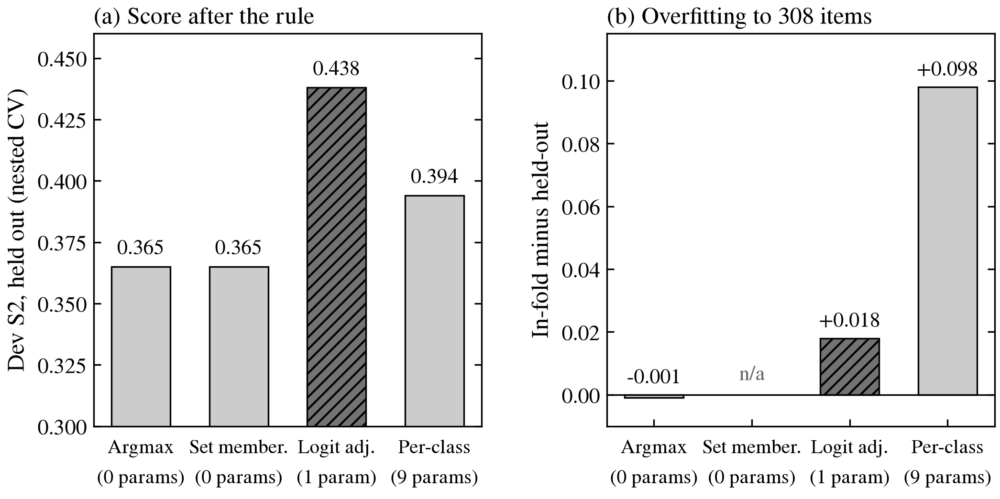
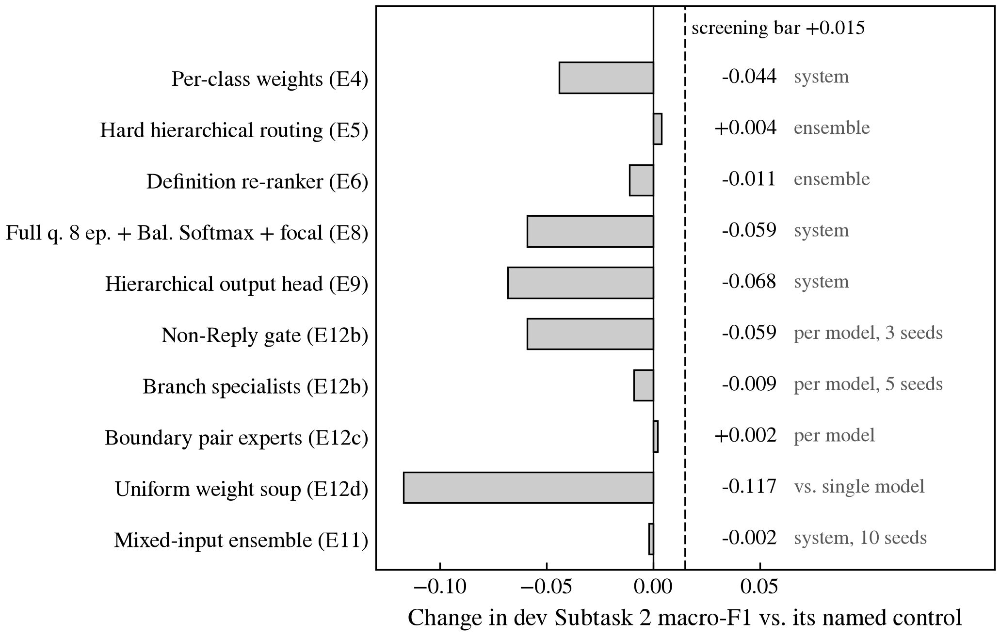
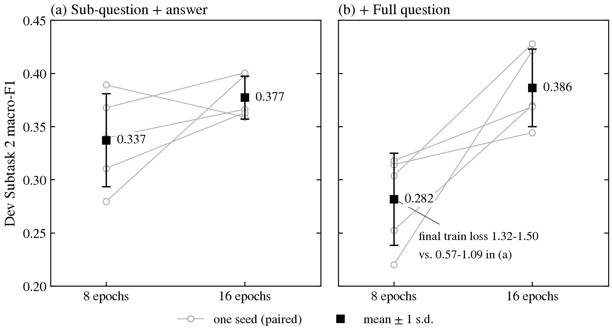
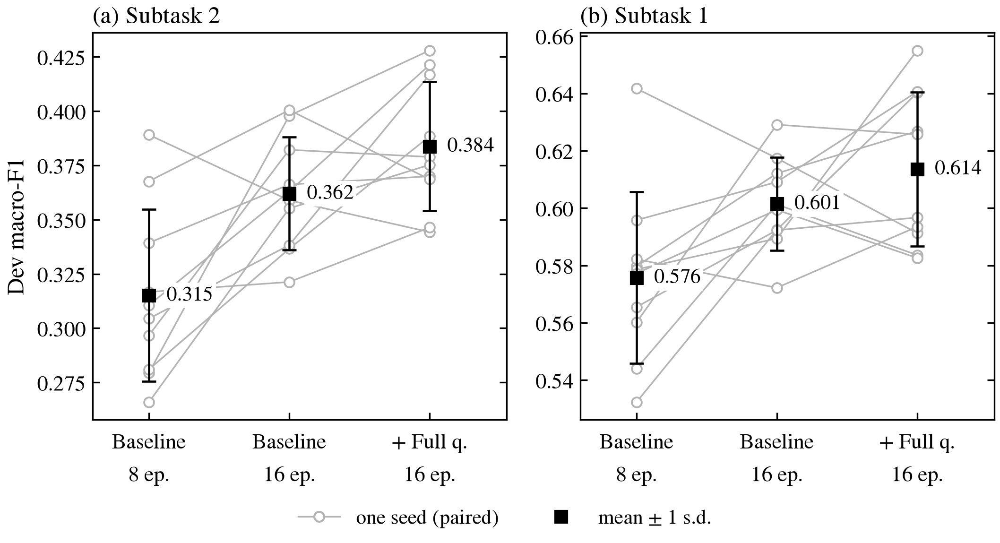
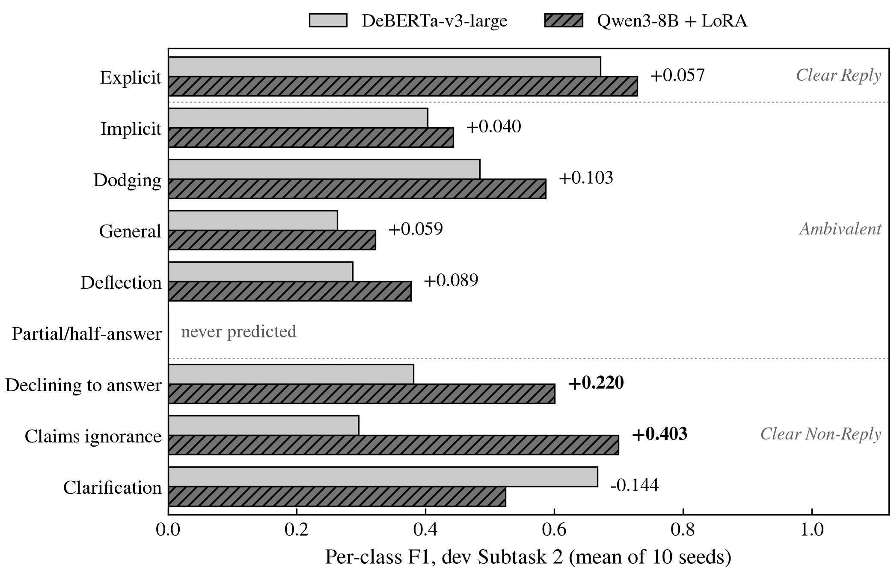
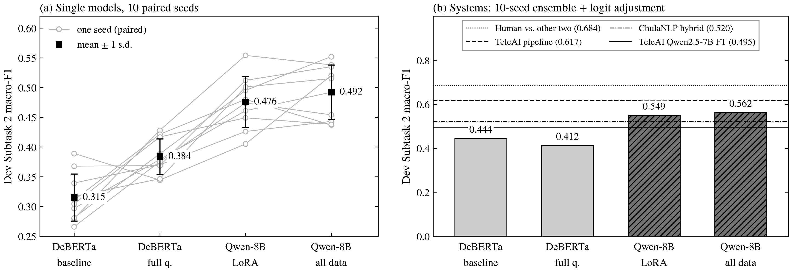
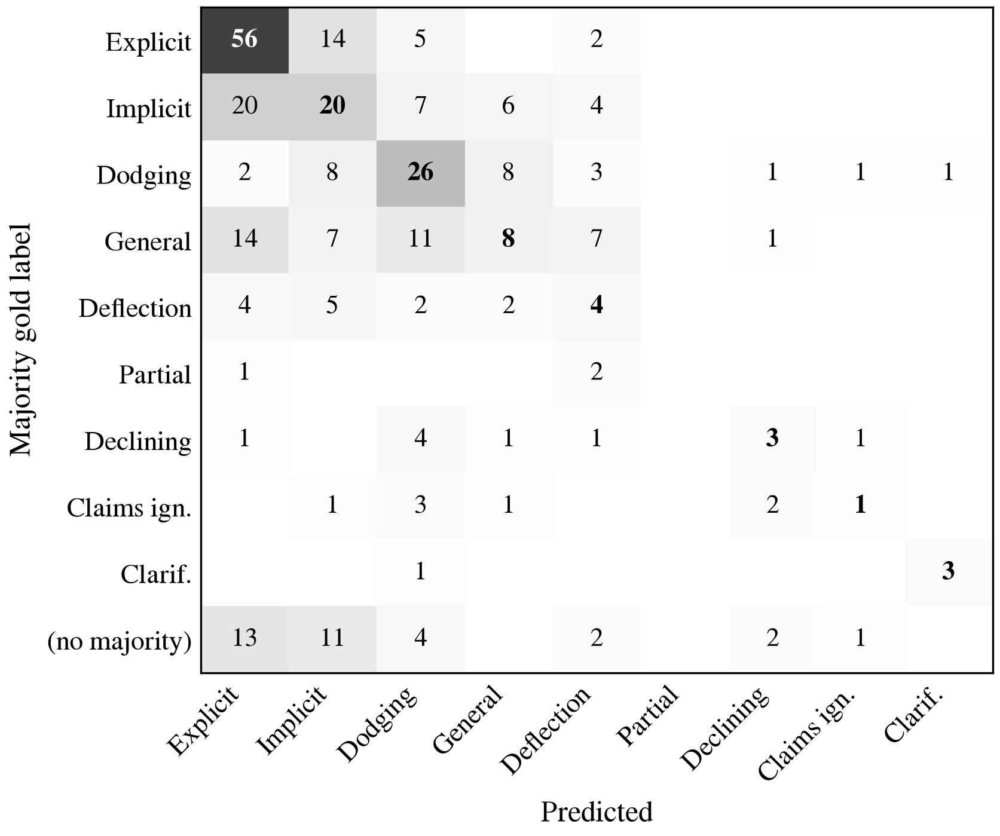

<!-- _class: lead -->
<!-- _paginate: false -->
<!-- _footer: "" -->

# Knowledge over Structure: A Controlled Study of Response Clarity Classification in Political Interviews

SemEval-2026 Task 6 (CLARITY): Unmasking Political Question Evasions

Mid-evaluation progress, from a DeBERTa baseline to a LoRA-tuned 8B classifier

<div class="meta">

**Team Nier_ANLP**, International Institute of Information Technology, Hyderabad
Vidvathama R (2024122002)  ·  Siddarth Gottumukkula (2023102040)
Sanjana Reddy Vonteri (2026901007)  ·  Shashikanta Sahoo (2026900007)
October 2026

</div>

---

# Problem formulation

<div class="columns">
<div class="left">

- Input: sub-question $q$ (15 tok), full question $Q$ (62), answer $a$ (266).
- Subtask 2 predicts one of 9 evasion types; Subtask 1 follows via $g$.
- 69% of train rows share an answer; 71.7% of those differ in label.
- Dev: 308 items, 3 annotators; only 125 unanimous. Test labels never released.

</div>
<div class="right">

$$
x=(q,\,Q,\,a),\qquad f:\mathcal{X}\rightarrow\mathcal{Y}_9,\qquad g:\mathcal{Y}_9\rightarrow\mathcal{Y}_3
$$

$$
\hat y_i \in G_i \Rightarrow \mathrm{TP}_{\hat y_i},\qquad
\hat y_i \notin G_i \Rightarrow \mathrm{FP}_{\hat y_i},\ \mathrm{FN}_c\ \ \forall c\in G_i
$$

$$
\text{if } \hat y_i\in G_i\ \forall i:\qquad
\text{macro-F1}=\frac{\left|\{\hat y_1,\dots,\hat y_N\}\right|}{9}
$$

<div class="caption">Multi-reference macro-F1: G<sub>i</sub> is the set of annotator labels. The score rewards landing in-set <em>and</em> naming every class, so Clarification (4 dev sets) weighs as much as Explicit (115).</div>

</div>
</div>

---

# Existing baselines and state of the art

<div class="columns">
<div class="left">

- Fine-tuned encoders plateau near 0.50 test S2, regardless of size or ensembling.
- Winners use multi-call LLM pipelines: 1.94 calls, about 7,300 input tokens per item.
- Published systems change several components at once; gains cannot be attributed.
- Our question: what limits a **single-pass** classifier on this task?

</div>
<div class="right">

| System (dev set) | Type | S2 | S1 |
|---|---|---|---|
| Always "Explicit" | floor | 0.060 | 0.136 |
| Uniform random | floor | 0.129 | 0.299 |
| TF-IDF + logistic regression | classical | 0.257 | 0.445 |
| ChulaNLP, DeBERTa-large fine-tune | encoder | 0.46 | 0.65 |
| TeleAI, Qwen2.5-7B fine-tune | single-pass LLM | 0.495 | |
| ChulaNLP, DeBERTa top-5 + Kimi-K2 | hybrid | 0.52 | |
| TeleAI, 3-stage DeepSeek-V3 (1st) | multi-call LLM | 0.617 | 0.812 |
| Human annotator vs other two | ceiling | 0.684 | |

<div class="caption">Floors: docs/raw/mideval/trivial_baselines.csv. Published rows: dev numbers reported in each team's paper, under their own protocols.</div>

</div>
</div>

---

# Proposed architecture and initial formulation

<div class="columns">
<div class="left">

- Hypothesis-driven: noise, decision rule, knowledge, or label meaning limits the model.
- One flat 9-way head; Subtask 1 derived through the fixed taxonomy $g$.
- System = 10-seed probability mean + one-parameter logit adjustment.
- Backbone is swappable: a later swap tests knowledge with everything else fixed.

</div>
<div class="right">

<div class="mermaid">
flowchart TD
  X["Input: sub-question q + full question Q + answer a, up to 1,024 tokens"] --> D["DeBERTa-v3-large: full fine-tune, CLS pooling"]
  X --> W["Qwen3-8B-Base + LoRA r=16: last-token pooling"]
  D --> H["New linear head: 9 logits, softmax per seed"]
  W --> H
  H --> E["Mean over 10 seeds"]
  E --> L["Logit adjustment: argmax of p / prior^tau, tau by nested CV"]
  L --> S2["Subtask 2: evasion type, 9 classes"]
  S2 --> S1["Subtask 1: clarity level, 3 classes, via g"]
  classDef swap fill:#E8EEF6,stroke:#2A78D6,stroke-width:2px,color:#0F172A
  class D,W swap
</div>

<div class="caption">Redrawn from Report Figure 1. Blue-bordered boxes are the one component that changes between tracks.</div>

</div>
</div>

---

# Evaluation protocol: one change at a time

<div class="columns">
<div class="left">

- Epoch chosen on a fixed 345-row train slice; dev never selects anything.
- Only dev-fitted parameter is $\tau$, chosen by 5-fold nested cross-validation.
- Seeds 0–9 paired across configurations: same head initialisation and data order.
- Hypotheses and predicted outcomes written to the log before every run.

</div>
<div class="right">

<div class="mermaid">
flowchart TD
  A["Register hypothesis and predicted outcome"] --> B["Change one component against a named control"]
  B --> C["Screen on 3 paired seeds"]
  C -->|"gain of at least +0.015, 2 of 3 seeds up"| D["Extend to 10 paired seeds"]
  C -->|"below the bar"| N["Log as negative, with its mechanism"]
  D --> E["System: 10-seed ensemble + logit adjustment"]
  E --> F["Paired delta, t, seeds up, bootstrap 95% CI, 2-annotator rescoring"]
  classDef neg fill:#F1F5F9,stroke:#94A3B8,color:#334155
  class N neg
</div>

<div class="caption">Protocol of Report §2; the screening bar is fixed in advance.</div>

</div>
</div>

---

# Iteration 1 (Steps 0–2, E0): a sound DeBERTa baseline

<div class="columns">
<div class="left">

- DeBERTa-v3-large: sub-question + answer, 512 tokens, 8 epochs, plain cross-entropy.
- Library loaded fp16 weights; attention overflowed, loss stuck at 1.887.
- Fixed by explicit fp32 load; baseline S2 0.337 ± 0.044 on 5 seeds.
- A 5-epoch rerun scored 0.223: schedule truncation, not a bad idea.

</div>
<div class="right">

```python
# code/models/encoder.py:176
# transformers 5.x loads DeBERTa-v3 in its stored fp16;
# the model then predicts "Explicit" for every item.
self.enc = AutoModel.from_pretrained(name, dtype=torch.float32)
```

| Seed | 0 | 1 | 2 | 3 | 4 | Mean |
|---|---|---|---|---|---|---|
| Dev S2 | 0.389 | 0.339 | 0.279 | 0.311 | 0.368 | **0.337** |
| Dev S1 | 0.642 | 0.580 | 0.532 | 0.596 | 0.579 | **0.586** |

<div class="caption">E0c, docs/raw/E0_analysis.txt. Seed spread (0.28–0.39) forces paired multi-seed comparisons from here on.</div>

</div>
</div>

---

# Iteration 2 (E2–E4): the ranking is better than the decision

<div class="columns">
<div class="left">

- 5-seed ensemble lifts S2 from 0.337 to 0.365.
- Acceptable label sits in the top 3 for 90% of items (oracle 0.745).
- One-scalar logit adjustment: **0.438** held out, +0.073, overfit gap only 0.018.
- Nine per-class weights overfit 308 items: in-fold gap +0.098.

</div>
<div class="right">



<div class="caption">E4, applied to the E0 5-seed ensemble; every score held out by nested CV. Logit adjustment joins every later system.</div>

</div>
</div>

---

# Iteration 3 (E5–E12): structure, losses and soups do not help

<div class="columns">
<div class="left">

- Three hierarchies (routing, factorised head, gate + specialists): none beats flat softmax.
- Definition re-ranker 0.354 vs 0.365: same 3,448 examples, no new knowledge.
- Weight soups fail: seeds differ in head initialisation and data order.
- Balanced Softmax + focal over-corrects: Explicit F1 falls 0.679 to 0.319.

</div>
<div class="right">



<div class="caption">Each variant against its own named control (docs/02_experiment_log.md). The comparison level differs by row and is printed beside each bar.</div>

</div>
</div>

---

# Iteration 4 (E7–E10): a failure that was undertraining

<div class="columns">
<div class="left">

- E7: a comparable published DeBERTa (0.46) sees the full journalist question.
- E8b: full question at 8 epochs scored **below** baseline (0.282 vs 0.337).
- Diagnosis: train loss 1.32–1.50, low confidence (top-p 0.445 vs 0.594).
- E10: 16 epochs reverse it; full question gives the best single model.

</div>
<div class="right">



<div class="caption">Single-model dev S2, seeds 0–4 (E0, E8b, E10 control, E10). E8's first diagnosis (the loss) was revised after this one-change control.</div>

</div>
</div>

---

# Iteration 5 (E10–E11): replication on new seeds

<div class="columns">
<div class="left">

- E11 reruns all three configurations on seeds 5–9: ten paired seeds.
- Per model: S2 0.315 to **0.384**, S1 0.576 to 0.614, 9 of 10 seeds up.
- Five-seed systems swing 0.08; E10's 0.478 fell to 0.434 on new seeds.
- Final DeBERTa system, by pre-registered rule: **0.405 S2, 0.648 S1**.

</div>
<div class="right">



<div class="caption">docs/figures/deck/deberta_seeds.png. Grey lines: one seed, paired across configurations; blue: mean of 10 seeds.</div>

</div>
</div>

---

# Iteration 6 (E13): the backbone as the one change

<div class="columns">
<div class="left">

- Remaining hypothesis: the 0.4B encoder lacks **knowledge**, not rule or labels.
- Swap DeBERTa for Qwen3-8B-Base, LoRA r=16 on all linear layers.
- Same rows, input, slice, loss and selection; padding self-check guards the head.
- Screen +0.081 (3/3), then ten seeds: S2 +0.092 and S1 +0.095, 10/10.

</div>
<div class="right">

| Registered before the run | Observed | Verdict |
|---|---|---|
| Passes the 3-seed screen | +0.081, 3 of 3 seeds | held |
| Single-model S2 in 0.43–0.50 | 0.476 ± 0.043 | held |
| S1 gain of +0.02 to +0.05 | +0.095 | exceeded |
| Gain on commitment boundary | largest on Non-Reply classes | wrong |
| Larger gain on agreed items | +0.076 agreed, +0.105 split | wrong |

```python
# code/models/llm_classifier.py:124
lora = LoraConfig(task_type=TaskType.SEQ_CLS, r=16, lora_alpha=32,
    lora_dropout=0.05, target_modules=["q_proj", "k_proj", "v_proj",
    "o_proj", "gate_proj", "up_proj", "down_proj"])
```

<div class="caption">Predictions from docs/02_experiment_log.md §E13; outcomes from docs/raw/E13_final_analysis.txt.</div>

</div>
</div>

---

# Iteration 7 (E13): where the 8B gain falls

<div class="columns">
<div class="left">

- Per-class F1 rises in 7 of 9 classes.
- Largest gains: Claims ignorance +0.403, Declining +0.220, both Non-Reply types.
- Commitment classes move least: Implicit +0.040, Explicit +0.057.
- Logit adjustment now worth +0.062 per Qwen model, +0.005 for DeBERTa.

</div>
<div class="right">



<div class="caption">Report Table 4: single models averaged over the same 10 seeds. Partial/half-answer is never predicted by either model.</div>

</div>
</div>

---

# Iteration 8 (E13b, E13c): two single-change follow-ups

<div class="columns">
<div class="left">

- 12 epochs: slice F1 +0.084 on all three seeds; adopted by registered rule.
- Selected epochs 8–11; train loss near 0.02 with no slice decline.
- All of train: +0.017 per model (6/10); system interval spans zero.
- Mixing Qwen and DeBERTa probabilities adds nothing (0.543 vs 0.549).

</div>
<div class="right">

| Follow-up (one change) | Variant | Qwen, 3 ep. | Delta | Seeds up | 95% CI |
|---|---|---|---|---|---|
| 12 epochs, single, S2 (seeds 0–2) | 0.543 ± 0.015 | 0.462 ± 0.080 | +0.082 | reported only | |
| All of train, single, S2 | 0.492 ± 0.045 | 0.476 ± 0.043 | +0.017 | 6/10 | |
| All of train, system, S2 | 0.575 | 0.543 | +0.028 | | [−0.026, +0.092] |

<div class="caption">Report Table 3 (bottom). The 12-epoch choice was made on the train slice; its dev score is reported, not used. As with the encoder, the 3-seed screen for all-of-train (+0.039) overstated the gain.</div>

</div>
</div>

---

# Comprehensive benchmark results

<div class="columns">
<div class="left">

- Backbone swap alone exceeds the whole encoder track's gain (+0.092 vs +0.069).
- System S2 +0.136, 95% CI [+0.054, +0.224]; holds on 2-annotator sets.
- Above TeleAI's fine-tuned 7B and ChulaNLP's hybrid; 0.074 below the winner.
- Zero LLM calls per item, against the winner's 1.94 calls.

</div>
<div class="right">

| System (dev) | S2 | S1 |
|---|---|---|
| DeBERTa baseline, single model | 0.315 ± 0.040 | 0.576 ± 0.030 |
| DeBERTa, full question + 16 ep., single | 0.384 ± 0.030 | 0.614 ± 0.027 |
| DeBERTa, 10-seed system | 0.405 | 0.648 |
| Qwen3-8B + LoRA, single model | 0.476 ± 0.043 | 0.709 ± 0.031 |
| **Qwen3-8B + LoRA, 10-seed system** | **0.543** | **0.746** |
| TeleAI, 1st place (multi-call) | 0.617 | 0.812 |



<div class="caption">Table: first nested-CV split. Bars in the plot: mean over 10 CV splits (0.412 and 0.549), hence the small difference.</div>

</div>
</div>

---

# Failure analysis

<div class="columns">
<div class="left">

- 137 of 308 DeBERTa predictions (44.5%) miss the reference set; 53 on unanimous items.
- Annotator vs other two: 0.684; ensemble 0.380. The model fails, not labels.
- Top error pairs: Implicit→Explicit 25, General→Implicit 20, General→Explicit 20.
- Length hurts: the 20 inputs still truncated land in-set 20% vs 58%.

</div>
<div class="right">



<div class="caption">Final DeBERTa 10-seed ensemble, argmax, rows = majority gold (docs/raw/mideval/). Error-pair counts in the bullets use reference sets, so they differ from this majority-vote view.</div>

</div>
</div>

---

# Annotated failure and limitations

<div class="columns">
<div class="left">

- Dev-only evaluation: 308 items, so system differences carry wide intervals.
- Labels moderately reliable: Fleiss $\kappa$ 0.48 on nine types; human ceiling 0.684.
- 12-epoch schedule screened on three seeds only; adopted, not established.
- Partial/half-answer never predicted; 8B pretraining may include these transcripts.

</div>
<div class="right">

| Dev item 17 | |
|---|---|
| Sub-question | Would you campaign against Senator Joe Lieberman on Iraq? |
| Answer | "I'm going to stay out of Connecticut." |
| Annotators | Dodging, Dodging, Implicit (S1: Ambivalent) |

| | DeBERTa system | Qwen system |
|---|---|---|
| Mean p, top 3 | General .373, Implicit .282, Deflection .205 | Dodging .327, Implicit .189, Declining .170 |
| Ensemble argmax | General (miss) | Dodging (in-set) |
| After logit adjustment | General (miss) | Declining (miss) |
| Subtask 1 | Ambivalent (correct) | Clear Non-Reply (miss) |

<div class="caption">Report Figure 4, chosen in advance. Reading it needs world knowledge (Lieberman is Connecticut's senator); the prior correction (0.205 vs 0.042) then moves Qwen's correct top-1 to a rarer class.</div>

</div>
</div>

---

# Summary and contributions

<div class="columns">
<div class="left">

- Encoder limits isolated: only longer training and the full question helped.
- Seven documented negatives (hierarchies, losses, re-ranker, soups), each with a mechanism.
- Knowledge hypothesis supported: the 8B backbone wins on all ten paired seeds.
- Our registered "where" prediction was falsified: the gain is broad.

</div>
<div class="right">

<div class="cards">
<div class="card">
<div class="label">DeBERTa-v3-large, 10-seed system</div>
<div class="value">0.405</div>
<div class="sub">dev S2 · S1 0.648</div>
</div>
<div class="card accent">
<div class="label">Qwen3-8B + LoRA, 10-seed system</div>
<div class="value">0.543</div>
<div class="sub">dev S2 · S1 0.746</div>
</div>
<div class="card">
<div class="label">System gain, Subtask 2</div>
<div class="value">+0.136</div>
<div class="sub">95% CI [+0.054, +0.224]</div>
</div>
<div class="card">
<div class="label">Acceptable label in Qwen top 3</div>
<div class="value">93.1%</div>
<div class="sub">top 5: 99.1% · in-set 0.87 vs 0.40 by confidence</div>
</div>
</div>

<div class="caption">The ranking-vs-decision gap motivates the cascade on the next slide.</div>

</div>
</div>

---

# Roadmap to the final evaluation

<div class="columns">
<div class="left">

- **Oct 5–11, M1:** 12-epoch Qwen on ten seeds; calibrated candidate set $C(x)$.
- **Oct 12–18, M3:** local LLM scores only $C(x)$, with definitions and boundary examples.
- **Oct 19–25, M2:** uncertainty router; sweep deferral $\delta$ for accuracy-vs-calls.
- **Oct 26–31, M4:** distil into M1, 4-bit inference; freeze and final scores.

<div class="takeaway">Target: at least 0.60 dev S2 with at most 0.3 LLM calls per item.</div>

</div>
<div class="right">

<div class="mermaid">
flowchart TD
  I["Input (q, Q, a)"] --> M1["M1 Candidate generator: Qwen3-8B + LoRA, K seeds, logit adjustment"]
  M1 --> M2{"M2 Router: uncertainty u(x)"}
  M2 -->|"keep, 1 - delta"| OUT["Subtask 2, then Subtask 1"]
  M2 -->|"defer, delta"| M3["M3 LLM adjudicator: scores labels in C(x), fused with M1"]
  M3 --> OUT
  M3 -.->|"soft targets on train"| M4["M4 Distillation into M1, 4-bit weights"]
  M4 -.-> M1
  classDef planned fill:#FFFFFF,stroke:#5B7B6F,stroke-width:2px,stroke-dasharray:5 4,color:#0F172A
  class M2,M3,M4 planned
</div>

<div class="caption">Redrawn from Report Figure 5; dashed modules are planned, none run yet. LLM calls per item equal delta.</div>

</div>
</div>

<script type="module">
  import mermaid from 'https://cdn.jsdelivr.net/npm/mermaid@10/dist/mermaid.esm.min.mjs';
  mermaid.initialize({
    startOnLoad: true,
    theme: 'base',
    themeVariables: {
      fontFamily: 'Inter, Helvetica, Arial, sans-serif',
      fontSize: '15px',
      primaryColor: '#FFFFFF',
      primaryBorderColor: '#64748B',
      primaryTextColor: '#0F172A',
      lineColor: '#64748B',
      edgeLabelBackground: '#F8F9FA'
    },
    flowchart: { curve: 'basis', htmlLabels: true }
  });
</script>
